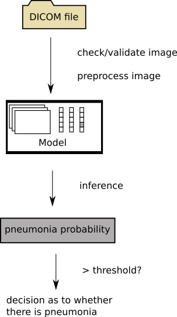
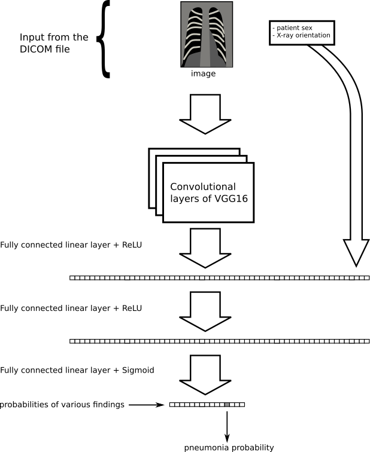
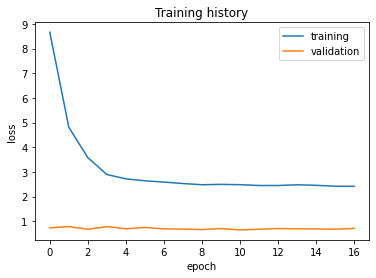
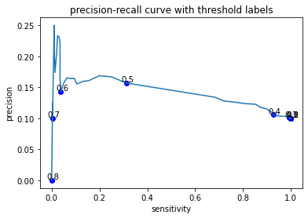
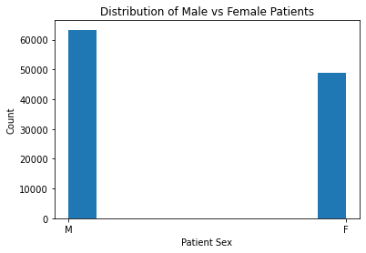
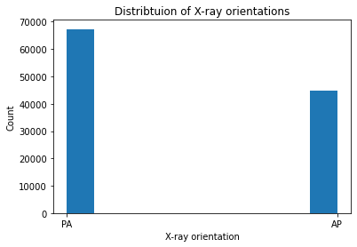
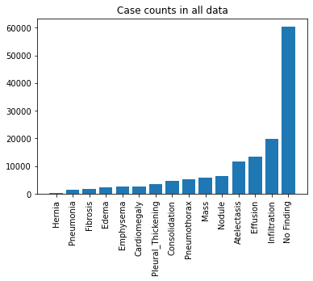
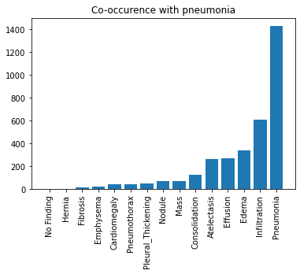

# FDA  Submission

**Your Name:**
Ebrahim Ebrahim

**Name of your Device:**
Deep Learning Algorithm for Pneumonia Detection

## Algorithm Description 

### 1. General Information

**Intended Use Statement:** 
This algorithm is used to assist a radiologist in determining whether
a chest X-ray shows signs of pneumonia.
It is intended for use with patients of ages 20-70
who have received a chest X-ray in either the anterior-posterior
or the posterior-anterior X-ray orientation.

**Indications for Use:**
This algorithm could be used in screening studies to replace a second or third radiologist.
It could also be used to adjust the order of a radiologist's queue of chest X-rays
such that patients whose situation is more likely to be urgent get their report sooner.

**Device Limitations:**
This algorithm should not be used with patients who are under the age of 15 or over the age of 75.
It should not be used on chest X-rays that are not of either AP or PA orientation,
and it should not be used on any body parts besides the chest.

**Clinical Impact of Performance:**
Since this algorithm is to intended be used as an aid to a human radiologist,
a false negative will not by itself put a patient at risk. False negatives and
false positives occur frequently, and radiologists using this algorithm will be aware of this.

### 2. Algorithm Design and Function

Here is an overview, with details below.

**DICOM Checking Steps:**
Given a DICOM file, we first verify that it is a chest X-ray
taken in one of the valid X-ray orientations for the model.
We do this by checking the DICOM fields _Modality_, _Body Part Examined_, and _Patient Position_.
We extract from the DICOM file the raw image pixel data as well as
some metadata: the patient sex and the X-ray orientation.

**Preprocessing Steps:**
The raw image data from the DICOM file comes in the form of grayscale pixel values.
This is converted to RGB and resized to 224 by 224 pixels using nearest neighbor interpolation.
No normalization is applied to the pixel intensities, since the ImageNet data that VGG16 was trained on 
was also not normalized.

**CNN Architecture:**
There are two parts: convolutional layers followed by fully connected layers.
The convolutional layers are derived from a pretrained VGG16 model and their weights were frozen during training.
The fully connected layers at the end of VGG16 were truncated away and replaced by two fully connected layers that were trained on the NIH
chest X-rays dataset.

There are two components to the inputs: image and metadata.
The preprocessed image of the X-ray is passed into the CNN at the start of the model pipeline.
Two bits of metadata, patient sex and X-ray orientation, are passed directly into the fully connected layer at the output end of the CNN.
After more fully connected layers, the final output is a vector of binary probabilities corresponding to the following possible findings:

- Pneumonia
- Cardiomegaly
- Infiltration
- Nodule
- Pleural Thickening
- Edema
- Atelectasis
- Effusion
- Mass
- Fibrosis
- Hernia
- Pneumothorax
- Emphysema
- Consolidation

During inference, we select from these only the pneumonia probability.

### 3. Algorithm Training

**Parameters:**

Image data was augmented by scaling, rotating, zooming, and shifting by random small amounts:

- Images were rotated by up to $\pm 15^\circ$.
- Images were shifted horizantally and vertically by up to 20% of their size.
- Images were zoomed by a factor of 0.8 to 1.2.

The output of the model is not a single probability distribution but
rather a list of probabilities of binary variables.
For training, a binary cross entropy loss is computed for each of these variables.
The binary cross entropy losses are then combined by taking a weighted mean, with the weighting
making the pneumonia probability loss more important than other radiologist finding labels.
This weighted mean is the loss that was used for training the model.

An Adam optimizer was used with a learning rate of 0.0001.

The fully connected layers that were added to the end of the model were trainiable, and the pre-existing VGG16
convolutional layers above were all frozen.
No layers were fine-tuned.

Below is a training history; note that training and validation losses are computed differently and should not be compared to each other.

Here is a precision-recall curve, which summarizes the possible tradeoffs one can
get by choosing various thresholds:

**Final Threshold and Explanation:**

The final threshold chosen is 0.48.
That is, the model will give a positive pneumonia result when the probability it outputs exceeds 0.45.

This was determined by optimizing an F\_2 score.
This means that we consider sensitivity to be twice as important as recall, and we find the threshold
that yields the best balance in that context.

This threshold gives our model a sensitivity of 0.81,
with a positive predictive value of 0.14.

### 4. Databases

**Training and Validation Datasets:**

The dataset consists of anonymized chest X-rays from real patients.
Since the original NIH dataset contains only 1145 positive pneumonia cases,
the training dataset for each epoch contains twice that: 2290 images.
This way, the model sees positive and negative pneumonia cases with equal frequency.
However we do replace the 1145 negative cases after each epoch, sampling randomly from
the pool of 110,975 negative cases.

The validation set consists of 2860 images, of which 286 are positive cases.

The distribution of patient ages and sexes is the same as it was for the original NIH dataset.

**Description of Population in Datasets:**

Both patient sexes are sufficiently represented:

Two X-ray orientations are represented in the original NIH dataset:

Here is a visualization of the frequency with which each radiologist finding label apears in the NIH dataset:

Selecting only the positive pneumonia cases out of this, we can look at the co-occurance of other findings with pneumonia:

### 5. Ground Truth

The ground truth labels are not based on a gold standard of actual patient biopsies,
but rather a silver standard of radiologist labels.
There is a further limitation:
the labels were extracted from written radiology reports using NLP.
The team that extracted the labels estimates accuracy to be over 90%.

### 6. FDA Validation Plan

**Patient Population Description for FDA Validation Dataset:**
We would request from our clinical partner a collection of chest X-rays in either the AP or the PA oriention.
Patient age range should be about 15-75, and there should be sufficient representation of both
male and female patients. Positive pneumonia cases are the most desirable finding for the dataset,
but other findings will also be useful. Chest X-rays should be provided in DICOM format,
or a different image format with the following associated metadata: patient sex and xray orientation.

**Ground Truth Acquisition Methodology:**

Since the intended use is to aid a radiologist in their investigation, radiologist labels should be
a sufficient source of ground truth.

**Algorithm Performance Standard:**

We will run the model on the new validation dataset and obtain a pneomonia probability for each X-ray.
We will then compute the optimal F1 score.
If this is comparable to or greater than 0.387, then we will say our model performing up to standards;
the F1 score 0.387 is the average performance of radiologists found in (Rajpurkar et al. 2017). 

# References

[Pranav Rajpurkar, et al. "CheXNet: Radiologist-Level Pneumonia Detection on Chest X-Rays with Deep Learning." (2017).](https://arxiv.org/pdf/1711.05225.pdf)
